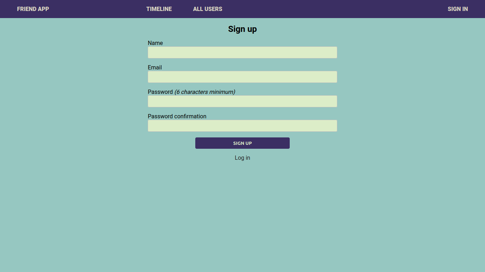
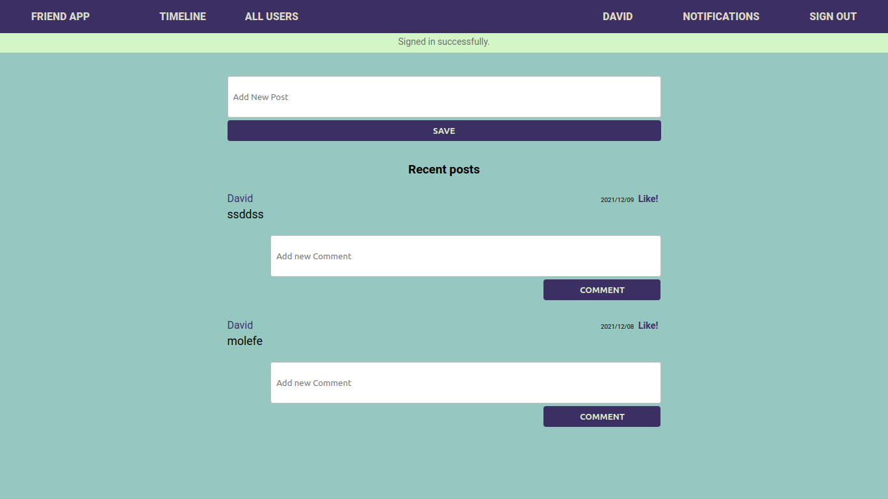

# Blog app: add API endpoints

> Build an API that is RESTful.
> In this project we create API endpoints that allows user to interact with Social app. The user must be authenticated first.






## Built With

- Ruby v2.7.0
- Ruby on Rails v5.2.4

### Prerequisites

Ruby: 2.7.0
Rails: 5.2.3
Postgres: >=9.5

## Getting Started

To get a local copy up and running follow these simple example steps.
1. Open Terminal.
2. Navigate to your desired location to download the contents of this repository.
3. Clone this repository: ```git clone https://github.com/TSHEPO-CLOUD/blog-api```
4. Run ```cd blog-api```

### Setup

Instal gems with:

```
bundle install
```

Setup database with:

```
   rails db:create
   rails db:migrate
```


## Use

- Navigate to the root directory of the project
- Run `rails server`
- Open a browser and visit `127.0.0.1:3000`
- Sign in and create events!

## Testing

- Run Rspec 'rspec -f -d'

## Authors

👤 **Shonibare Adewunmi Comfort**
- GitHub: [@Adewunmi97](https://github.com/Adewunmi97)
- Twitter: [@ShonibareC](https://twitter.com/ShonibareC)
- Linkedin: [Adewunmi Shonibare](https://www.linkedin.com/in/adewunmi97)

👤 **Tshepo David**

- GitHub: [@githubhandle](https://github.com/TSHEPO-CLOUD)
- Twitter: [Twetter](https://twitter.com/tshepomolefem)
- Linkedin: [Linkedin](https://www.linkedin.com/in/tshepo-molefe-8153313b)


## Acknowledgements


## Show your support

Give a ⭐️ if you like this project!